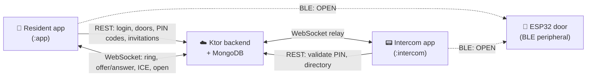

# Syekso

**A connected building-access app for Android — with real BLE hardware, a real backend, and real WebRTC video calls.**

Syekso is a portfolio project modelled on a connected building-intercom product: residents open doors
from their phone over Bluetooth Low Energy, share time-limited access codes with visitors, and answer
a video call from the lobby intercom — unlocking the door remotely while the visitor is still on screen.

Nothing here is mocked. The door is a real **ESP32** BLE peripheral. The backend is a real **Ktor +
MongoDB** server with JWT auth. The intercom is a **second Android app** running on a second device.
Every feature below has been verified end-to-end on physical hardware.

---

## What it does

| | Feature | Status |
|---|---|---|
| 🔑 | **Login & building activation** — JWT session persisted in an encrypted proto DataStore; redeem an activation code to attach a building | ✅ |
| 🚪 | **Open a door over BLE** — scan for the door's advertised name, connect, write the `OPEN` command to a GATT characteristic, the ESP32 fires its relay | ✅ |
| 🔢 | **One-time PIN codes** — the resident generates a numeric PIN, the visitor types it on the lobby intercom, the backend validates and burns it, the intercom opens the door | ✅ |
| 📅 | **Personalised invitations** — titled, time-windowed, multi-use codes for a single door (e.g. "Plumber, Tuesday 9–11am") | ✅ |
| 📞 | **Video call from the intercom** — WebRTC video + two-way audio between the lobby intercom and the resident's phone, with **unlock-during-call** | ✅ |
| 🛎️ | **Remote open without video** — the intercom rings, the resident taps *Ouvrir*, the command travels phone → backend → intercom → door | ✅ |
| 🕓 | Access history | Placeholder |
| 👤 | Profile & logout | Placeholder |

---

## How the pieces fit together

Two Android apps, one backend, one piece of hardware:



**The three ways a door opens** — the interesting part of the domain:

1. **Resident is at the door** → phone talks straight to the lock over BLE. No network needed beyond
   fetching the door list.
2. **Visitor is at the door alone** → types a PIN on the intercom → the intercom asks the backend
   whether that code is valid *right now* for *that door* → on success the intercom opens over BLE.
   Single-use codes are burned on first use; invitations are checked against their time window.
3. **Visitor rings** → WebRTC call to the resident's phone → the resident sees who it is and taps
   *Ouvrir* → the unlock travels over the signaling socket to the intercom, which opens the door.
   The call stays alive through the unlock.

---

## Architecture

Multi-module, Now-in-Android style — 15 Gradle modules with a strict `feature → core` dependency
direction and no feature-to-feature edges.

```
:app                     Resident app: nav host, auth gate, incoming-call overlay
:intercom                Standalone lobby-intercom app (2nd device)

:feature:onboarding      Login
:feature:home            Doors list + BLE open + building activation
:feature:sharing         PIN codes + personalised invitations
:feature:intercomcall    Incoming-call overlay & callee-side WebRTC

:core:model              Pure Kotlin domain types (no Android)
:core:network            Retrofit contract, DTOs, WebSocket signaling client
:core:database           Room — offline cache for the doors list
:core:datastore          Proto DataStore session store
:core:datastore-proto    Generated protobuf schema
:core:crypto             Android Keystore encryption for the session blob
:core:data               Repositories — the single source of truth
:core:ble                GATT contract + BLE controller behind an interface
:core:webrtc             Peer connection, tracks, renderer
:core:designsystem       Material 3 theme
```

### Decisions worth pointing at

**Every hardware boundary sits behind an interface.** `SyeksoBleController` and `WebRtcSession` are
plain interfaces with Android implementations wired by Hilt. That is what makes the ViewModels
unit-testable off-device: the tests inject a `FakeSyeksoBleController` / `FakeWebRtcSession` and
assert on the emitted UI state, with no emulator and no ESP32 in the loop.

**The BLE GATT contract is a single shared source of truth.** `BleContract.kt` declares the service
UUID, the characteristic UUID and the `OPEN` payload; the ESP32 sketch mirrors them, and the firmware
README says so explicitly. Change one, change both.

**Type-safe navigation and type-safe project accessors.** Routes are `@Serializable` objects rather
than strings, and `TYPESAFE_PROJECT_ACCESSORS` is enabled — a renamed module or a typo'd route is a
compile error, not a runtime crash.

**The session is encrypted at rest.** The JWT lives in a proto DataStore whose serializer encrypts
through an Android Keystore-backed key, so the token never sits in plaintext on disk.

**The bearer token is passed explicitly, not injected.** `:core:network` takes the token as a
parameter instead of reaching for it through an interceptor, which keeps it free of any dependency
on where the session is stored — the repository in `:core:data` owns that.

### Things the hardware taught us

Real devices produce bugs that no emulator does. A few that are documented in the code:

- **BLE advertising doesn't restart after a disconnect.** A peripheral stops advertising the moment a
  central connects. Without an explicit restart in `onDisconnect`, the door opens exactly once per
  power cycle, then goes dark. Symptom: "works, then *door not found* forever".
- **A 128-bit service UUID overflows the 31-byte advertising packet** and NimBLE silently drops the
  local name — which is exactly what the Android side scans for. Fix: advertise the name only; the
  service is still discoverable after connecting.
- **`startScan(callback)` uses a low-power duty cycle** (~10%) and intermittently misses the
  advertiser. A short foreground unlock needs `SCAN_MODE_LOW_LATENCY`.
- **An open microphone flips Android to earpiece routing**, so the resident holds a video call to
  their ear. Fix: `MODE_IN_COMMUNICATION` + speakerphone, plus hardware AEC via
  `JavaAudioDeviceModule` for the demo case where both devices sit on the same desk.
- **The remote video renderer can be attached before `onTrack` fires.** Binding on either event alone
  gives you a black square half the time; the session holds a `pendingRenderer` and binds when both
  sides are ready.

---

## Tech stack

**Kotlin 2.2** · **Jetpack Compose** (Material 3, type-safe Navigation) · **Hilt** · **Coroutines &
Flow** · **Retrofit + kotlinx.serialization** · **OkHttp WebSocket** · **Room** · **Proto DataStore**
· **Android Keystore** · **stream-webrtc-android** · **Android BLE (GATT)** · AGP 9, minSdk 26,
targetSdk 36.

**Backend:** Ktor 3 · MongoDB Atlas · JWT — [`AccessControllerServer`](https://github.com/Rodolphe18/AccessControllerServer) (separate repo).
**Hardware:** ESP32 + NimBLE-Arduino 2.x — firmware in [`hardware/esp32-door/`](hardware/esp32-door/).

---

## Running it

You need the phone, the backend and (for door opening) an ESP32 on the same Wi-Fi.

```bash
# 1. Flash the door — Arduino IDE, ESP32 board package, NimBLE-Arduino library
#    hardware/esp32-door/esp32-door.ino — its DEVICE_NAME must match a door's
#    bleLocalName in the backend seed data

# 2. Start the backend (separate repo), with MONGODB_URI set. Port 8080.

# 3. Point the app at your machine's LAN IP
#    core/network/build.gradle.kts → BASE_URL (debug)
#    app/src/main/res/xml/network_security_config.xml → whitelist that IP for cleartext

# 4. Resident app
./gradlew :app:installDebug

# 5. Intercom app — install on a SECOND device
./gradlew :intercom:installDebug

# 6. Tests
./gradlew test
```

The backend seeds a demo user, a building ("Résidence Montmartre") with two doors, and an unredeemed
activation code — see its README for the credentials.

> **Note:** the intercom app authenticates to the backend with a shared key (`INTERCOM_KEY` in
> `intercom/build.gradle.kts`) that must match the server's. It's a demo shortcut standing in for
> device provisioning.

---

## Not built (deliberately)

- **BLE challenge–response.** The current unlock is a fixed `OPEN` write, which is replayable by
  anyone within range. The real design is a nonce + HMAC handshake against a per-door key; it's the
  next iteration, and the code says so where it matters.
- **Access history and profile screens** are navigable placeholders.
- **No TURN server.** Calls work on a shared LAN; a production deployment needs TURN for peers behind
  symmetric NAT.

Design docs for each iteration live in [`docs/`](docs/) — one spec and one implementation plan per
feature.
